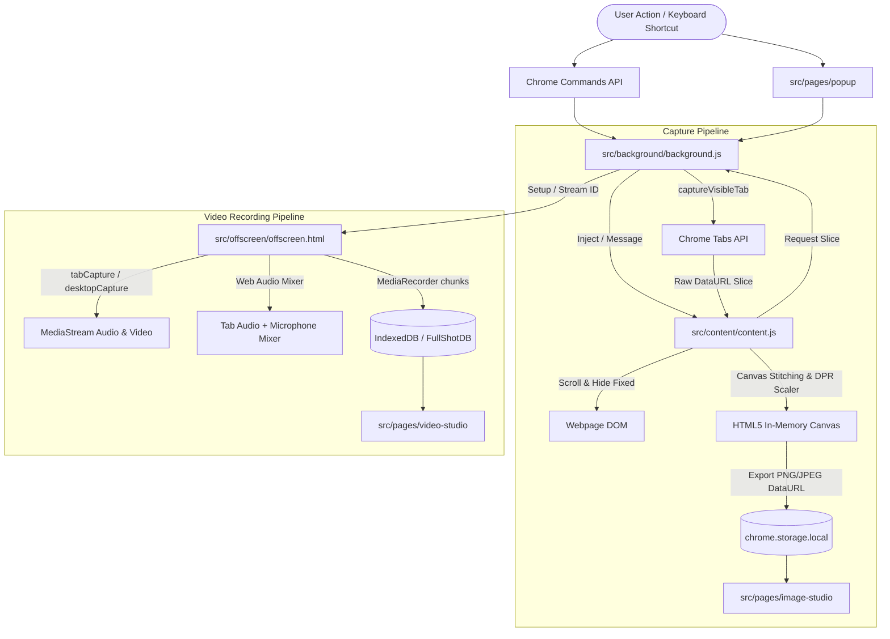
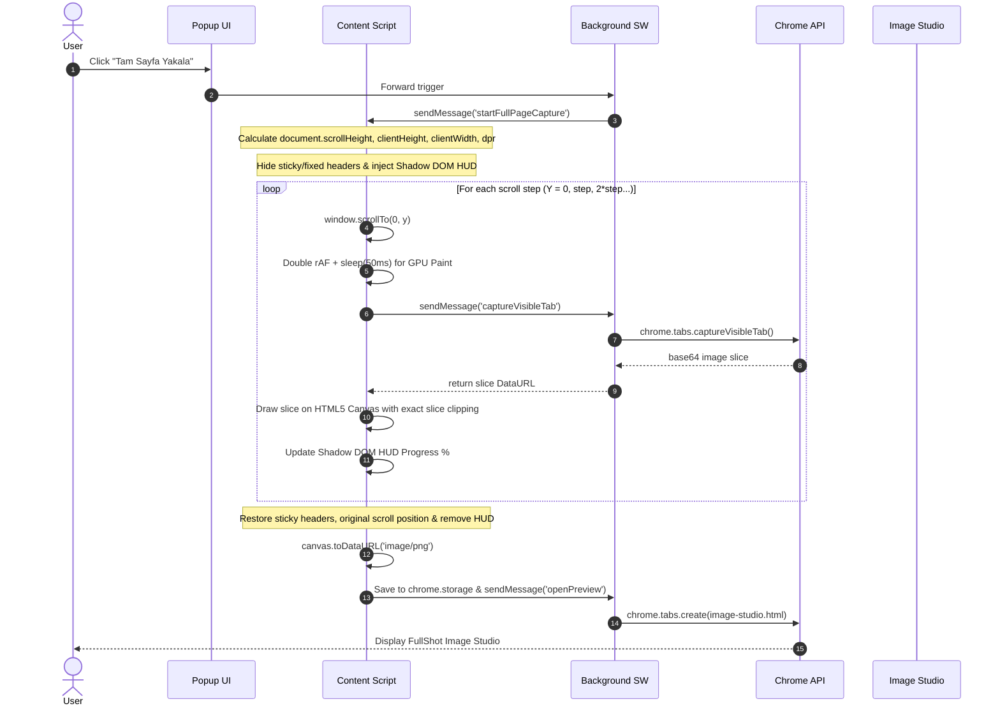

# ARCHITECTURE.md - System Design & Flow

This document details the architectural design, communication protocols, state machines, and data pipelines of **FullShot Pro**.

---

## 🏗️ 1. High-Level Architecture Diagram



---

## 🔄 2. Full Page Screenshot Stitching Lifecycle



---

## 🎙️ 3. Video Recording & Web Audio Mixing Pipeline

```mermaid
sequenceDiagram
    autonumber
    actor User
    participant Popup as Popup UI
    participant BG as Background SW
    participant Offscreen as Offscreen Document
    participant IDB as IndexedDB (FullShotDB)
    participant VideoStudio as Video Studio

    User->>Popup: Select Scope (Tab/Screen) & Mic Toggle -> Click "Kaydı Başlat"
    Popup->>BG: sendMessage('START_RECORDING', config)
    BG->>BG: Create Keep-Alive Port & Heartbeat
    BG->>Offscreen: Setup offscreen document & delegate stream capture
    
    Note over Offscreen: Capture Tab/Display MediaStream
    opt Microphone Enabled
        Note over Offscreen: navigator.mediaDevices.getUserMedia(audio: true)
        Note over Offscreen: Create AudioContext -> ChannelMergerNode
    end
    
    Note over Offscreen: Initialize MediaRecorder (video/webm;codecs=vp9,opus)
    
    loop Every 1000ms
        Offscreen->>IDB: Write video/audio blob chunk to object store
        BG->>BG: Update badge timer (e.g. "01:23")
    end
    
    User->>Popup: Click "Kaydı Durdur"
    Popup->>BG: sendMessage('STOP_RECORDING')
    BG->>Offscreen: Finalize MediaRecorder
    Offscreen->>IDB: Finalize recording entry & metadata
    Offscreen-->>BG: Return recordingId
    BG->>BG: Reset state & close offscreen document
    BG->>VideoStudio: Open video-studio.html?id={recordingId}
```

---

## 🗄️ 4. Data Layer & Schemas

### Screenshot Capture Object (`chrome.storage.local: fullshot_current_capture`):
```json
{
  "dataUrl": "data:image/png;base64,iVBORw0KGgo...",
  "title": "GitHub - Repository Name",
  "url": "https://github.com/...",
  "width": 1920,
  "height": 5420,
  "format": "png",
  "timestamp": 1788012345000,
  "type": "fullpage"
}
```

### Video Recording Entry (`IndexedDB: FullShotVideoDB -> recordings`):
```json
{
  "id": "rec_1788012345678",
  "blob": "[Blob video/webm, size: 14.2 MB]",
  "title": "Screen Recording - 2026-08-29",
  "duration": 45.2,
  "width": 1920,
  "height": 1080,
  "format": "webm",
  "timestamp": 1788012345678,
  "type": "tab"
}
```
