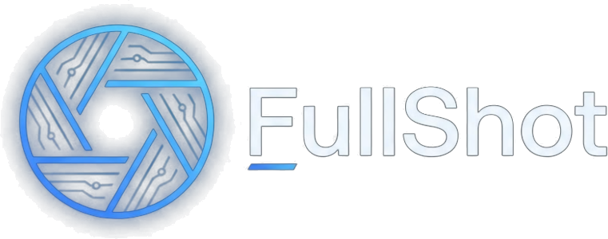

# FullShot Pro 📸🎥
### The Ultimate Open-Source Screenshot, Video Recording & Canvas Studio for Chrome

<p align="center">
  
</p>

<p align="center">
  <strong>A high-performance Manifest V3 browser extension for pixel-perfect full page captures, 3D device mockups, DLP auto-censoring, screencasting with audio DSP filters, and GIF export. Zero third-party dependencies. 100% local and privacy-first.</strong>
</p>

<p align="center">
  <a href="#-english"></a>
  <a href="#-t%C3%BCrk%C3%A7e"></a>
  
  
  
  
</p>

<p align="center">
  <a href="#english"><b>🇬🇧 English Docs</b></a> • <a href="#turkish"><b>🇹🇷 Türkçe Dokümantasyon</b></a>
</p>

---

<a id="english"></a>
# 🇬🇧 English

## 💡 Why FullShot Pro?

Most screenshot and screen-recording extensions share the same recurring headaches:
- Full-page captures break on sticky navigation bars or infinite scroll pages.
- Markups and annotations look blurry on Retina and High-DPI displays.
- Service Workers shut down silently during long recordings due to aggressive MV3 timeouts.
- Developers and designers end up juggling 4 or 5 separate utilities for basic tasks: capturing screenshots, wrapping them in 3D device frames, redacting API keys, measuring CSS margins, and creating animated GIFs.

**FullShot Pro** solves this by unifying a full suite of high-precision capturing, 2D/3D canvas editing, and video recording tools into a single, clean, **zero-dependency** Chrome Extension. Everything is processed **100% locally in your browser**—no tracking, no cloud uploads, and no external analytics.

---

## ✨ Key Capabilities

### 📸 1. Precision Capture Engine
- **📜 Intelligent Full-Page Stitching (<kbd>Alt + Shift + F</kbd>)**: Automatically scrolls and captures infinite/dynamic DOM pages. Features smart top-docked sticky header filtering (`rect.top <= 2`) to prevent duplicate navigation bars.
- **🖥️ Visible Viewport Capture (<kbd>Alt + Shift + V</kbd>)**: Instant one-click capture synchronized via double-`requestAnimationFrame` and GPU reflow pipeline to prevent ghost HUD artifacts.
- **🎯 Interactive DOM Element Snapper (<kbd>Alt + Shift + E</kbd>)**: Hover over any card, button, table, or modal dialog with live outline snapping; click to capture that exact element.
- **✂️ Area Crop with 8x Loupe & Color Picker (<kbd>Alt + Shift + S</kbd>)**: Pixel-precise crop box accompanied by an 8x zoom loupe. Press <kbd>C</kbd> while cropping to copy the exact HEX/RGB color code under your cursor.
- **⚡ In-Page Quick Bar HUD**: A boundary-aware floating toolbar appears right after area captures, allowing you to instantly Copy, Download, Extract Text (OCR), or send to Image Studio.

---

### 🎨 2. 2D/3D Canvas Image Studio
- **📐 3D Isometric Tilt & Device Mockups**:
  - Continuous **-25° to +25°** horizontal and vertical 3D isometric rotation using affine matrix projections and bilinear interpolation.
  - **4 Device Enclosures**: iPhone 16 Pro titanium frame, Safari Window, macOS Terminal, and Clean Rounded Card.
  - **6 Mesh Gradient Themes**: Cyber Neon, Sunset Glow, Deep Void, Obsidian, Aurora, and Clean Studio.
- **🛡️ Smart DLP Auto-Censor (<kbd>Shift + B</kbd>)**:
  - Automatically scans and redacts sensitive data using regular expressions and the **Luhn Mod-10 algorithm** (Credit Cards, E-mail addresses, API keys, IP addresses, and National IDs).
- **🔦 Spotlight Focus Frame (<kbd>F</kbd>)**: Highlights a focal region with a glowing neon frame while dimming the background stage by 65%.
- **🔍 3D Glass Magnifier Lens (<kbd>Z</kbd>)**: Realistic 1.5x - 4.0x optical zoom loupe with authentic specular glare reflection.
- **🏷️ QA Stamps & 3D Keycaps (<kbd>E</kbd>)**: Vector quality stamps (`[APPROVED]`, `[REJECTED]`, `[BUG]`, `[WIP]`) and isometric 3D keyboard keys (`[Ctrl]`, `[Cmd]`, `[Shift]`).
- **🧽 Smart Object Eraser**: Click or drag across any vector arrow, text, shape, or stamp to selectively erase items without losing history.
- **🎨 2D HSV Professional Color Studio**: Interactive 2D HSV saturation/value box, hue slider, built-in EyeDropper API, and a 2-row color palette.
- **✏️ Vector Drawing Suite**: Solid continuous ribbon pen, translucent highlighter, Bézier curved single/double arrows, auto-incrementing step counters (#1, #2, #3...), and frosted glass callouts.
- **🖨️ Multi-Format Exporters**: Lossless Retina 1:1 PNG, compressed JPEG, WebP, instant ClipboardItem copy, and zero-dependency UTF-8 PDF 1.4 generation.

---

### 🎥 3. Pro Video & Screencast Studio
- **🎬 Flexible Recording Modes**: Record current tab or entire desktop/application window with hardware acceleration.
- **🎙️ Web Audio DSP Engine**:
  - Real-time mixer for microphone and tab audio.
  - Active **85Hz High-Pass filter** to eliminate low-end room rumble and **50Hz/60Hz Notch filters** to cut electrical line hum.
- **🎛️ Live Presentation HUDs**:
  - **Draggable Camera Bubble**: Resizable webcam overlay (S/M/L) with mirror mode and an **Audio Halo Meter** that pulses neon green/cyan with your voice.
  - **Click Shockwaves & Spotlight (<kbd>Alt + Shift + S</kbd>)**: Visual blue/red click wave pulses and cursor presentation spotlight.
  - **Floating Recording Bar**: Draggable in-page timer with live duration and instant stop button.
- **🎞️ Non-Destructive Trimming & GIF Exporter**:
  - Timeline In/Out trim markers in Video Studio.
  - Pure JavaScript **Median-Cut + LZW animated GIF encoder** for high-quality, lightweight GIFs.
  - **EBML Duration Recovery**: Injects missing duration headers into WebM recordings to ensure smooth timeline seeking.

---

### 🛠️ 4. In-Page Developer Tools
- **📏 Figma-Style Pixel Ruler (<kbd>Alt + Shift + R</kbd>)**: Inspect live DOM dimensions, bounding boxes, and measure exact pixel distances between any two elements on the page.
- **📌 Pin to Screen (Document Picture-in-Picture)**: Keep your reference screenshots floating on top of any webpage or app with 10% - 100% opacity adjustment.
- **🔤 Client-Side OCR**: Extract unselectable text from images, tables, and charts directly from the browser into your clipboard.

---

## ⌨️ Keyboard Shortcuts Reference

| Shortcut | Scope | Action |
|---|---|---|
| <kbd>Alt</kbd> + <kbd>Shift</kbd> + <kbd>F</kbd> | Browser | 📜 Capture Full Page Screenshot |
| <kbd>Alt</kbd> + <kbd>Shift</kbd> + <kbd>V</kbd> | Browser | 🖥️ Capture Visible Viewport |
| <kbd>Alt</kbd> + <kbd>Shift</kbd> + <kbd>E</kbd> | Browser | 🎯 Interactive DOM Element Snapper |
| <kbd>Alt</kbd> + <kbd>Shift</kbd> + <kbd>S</kbd> | Browser | ✂️ Precision Area Selection Crop |
| <kbd>Alt</kbd> + <kbd>Shift</kbd> + <kbd>R</kbd> | Browser | 📏 Toggle Figma Pixel Distance Ruler |
| <kbd>C</kbd> | Crop Mode | 🔍 Copy HEX color under cursor |
| <kbd>Shift</kbd> + <kbd>B</kbd> | Image Studio | 🛡️ Trigger DLP Auto-Censor |
| <kbd>F</kbd> | Image Studio | 🔦 Activate Spotlight Focus Tool |
| <kbd>Z</kbd> | Image Studio | 🔍 Activate Optical Glass Magnifier |
| <kbd>E</kbd> | Image Studio | 🏷️ Open QA Stamps & Keycaps Drawer |
| <kbd>Ctrl</kbd> + <kbd>Z</kbd> / <kbd>Ctrl</kbd> + <kbd>Y</kbd> | Image Studio | ↩️ Undo / Redo |
| <kbd>Space</kbd> + <kbd>Drag</kbd> | Image Studio | ✋ Pan across Canvas Stage |

---

## 🏗️ Architecture & Project Structure

```
chrome ss/
├── manifest.json                            # Manifest V3 configuration & permission definitions
├── package.json                             # Automation scripts & test runners
├── README.md                                # Project documentation (English & Turkish)
├── AGENTS.md                                # Single source of truth for engineering guidelines
├── ARCHITECTURE.md                          # Data flow charts & state machine specs
│
├── assets/                                  # High-DPI logos & extension icons
│   ├── branding/                            # FullShot vector & raster headers
│   └── icons/                               # 16, 32, 48, 128px PNG icons
│
├── scripts/                                 # Zero-dependency test & packaging tools
│   ├── validate.js                          # 130+ automated syntax, MV3 & link checks
│   ├── browser-test.js                      # DOM runtime & studio binding verification
│   └── package-zip.js                       # Production zip bundle compiler
│
└── src/                                     # Modulated application source code
    ├── background/
    │   └── background.js                    # Service Worker: capture coordinator & keep-alive
    │
    ├── content/                             # Injected scripts & isolated Shadow DOM HUDs
    │   ├── content.js                       # Main message router & keyboard dispatcher
    │   ├── capture/                         # DOM measuring, scroll stitching & sticky filter
    │   └── hud/                             # Area selector, camera bubble, pixel ruler, pin window...
    │
    ├── offscreen/                           # MV3 offscreen document for media processing
    │   ├── offscreen.html
    │   └── offscreen.js                     # MediaRecorder, Web Audio DSP mixer & OCR engine
    │
    ├── pages/                               # Extension User Interfaces
    │   ├── popup/                           # Extension toolbar popup interface
    │   ├── image-studio/                    # 2D/3D markup canvas, auto-censor, 3D mockups & PDF
    │   └── video-studio/                    # Video timeline editor, trimming & animated GIF exporter
    │
    └── shared/                              # Cross-boundary constants & FullShotMediaDB v2 (IndexedDB)
```

---

## 🚀 Installation & Local Setup

1. Clone or download this repository:
   ```bash
   git clone https://github.com/cagannbl/fullshot-extension.git
   ```
2. Open Google Chrome and navigate to `chrome://extensions`.
3. Enable **Developer mode** using the toggle in the top-right corner.
4. Click **Load unpacked** (*Paketlenmemiş öğe yükle*) and select the project directory.
5. Pin **FullShot Pro** to your Chrome toolbar for quick access!

---

## 🧪 Testing & Quality Assurance

FullShot Pro includes a zero-dependency automated verification suite with over 130 checks covering MV3 security guardrails, Keep-Alive ports, IndexedDB stores, and HTML/CSS link integrity:

```bash
# Run complete architectural & syntax audit (130+ tests)
npm test

# Run deep DOM & browser runtime verification
npm run test:browser

# Build production-ready distribution package (dist/FullShot-Pro-Extension.zip)
npm run build:zip
```

---
---

<a id="turkish"></a>
# 🇹🇷 Türkçe

## 💡 Neden FullShot Pro?

Mevcut ekran görüntüsü ve video kayıt araçlarının büyük çoğunluğu benzer sorunlarla karşılaşır:
- Tam sayfa yakalamada üst menüler (`sticky navbar`) tekrarlanır veya kaydırma bozulur.
- Yüksek DPI / Retina ekranlarda alınan ekran görüntüleri ve çizimler bulanıklaşır.
- Manifest V3 Service Worker kısıtlamaları yüzünden uzun video kayıtları sessizce çöker.
- Ekran görüntüsü almak, bunu 3D cihaz çerçevesine yerleştirmek, hassas verileri gizlemek, piksel ölçmek ve GIF oluşturmak için 4-5 farklı yazılım kullanmak zorunda kalınır.

**FullShot Pro**, tüm bu ihtiyaçları sıfır harici bağımlılık (**zero-dependency**), modern **Manifest V3**, **HTML5 Canvas**, **Web Audio API** ve **IndexedDB** mimarisiyle tek bir eklentide birleştirir. Tüm işlemler **%100 yerel olarak tarayıcınızda** gerçekleşir; hiçbir veriniz sunuculara veya üçüncü taraf analiz servislerine gönderilmez.

---

## ✨ Öne Çıkan Özellikler

### 📸 1. Akıllı Ekran Yakalama Motoru
- **📜 Tam Sayfa Dikişleme (<kbd>Alt + Shift + F</kbd>)**: Sabit üst menüleri (`rect.top <= 2`) otomatik filtreleyerek piksel kayıpsız dikey dikişleme yapar.
- **🖥️ Görünür Alanı Yakala (<kbd>Alt + Shift + V</kbd>)**: Ekranda görünen kısmı GPU çift rAF senkronizasyonuyla anında yakalar.
- **🎯 Etkileşimli DOM Öğesi Yakala (<kbd>Alt + Shift + E</kbd>)**: Fareyle üzerine geldiğiniz buton, tablo, kart veya diyaloğu otomatik çerçeveler; tek tıkla kaydeder.
- **✂️ 8x Büyüteç & Canlı Renk Seçici (<kbd>Alt + Shift + S</kbd>)**: Serbest kırpma esnasında 8x yakınlaştırma büyüteci açılır. <kbd>C</kbd> tuşuna basarak pikselin HEX/RGB renk kodunu panoya kopyalayabilirsiniz.
- **⚡ Sayfa İçi Hızlı Aksiyon Çubuğu (Quick Bar HUD)**: Çekim bittiği an beliren yüzen bar ile tek tıkla Kopyalama, İndirme, Metin Okuma (OCR) veya Stüdyoya gönderme.

---

### 🎨 2. 2D/3D Görsel Düzenleme Stüdyosu (Image Studio)
- **📐 3D İzometrik Eğim & Mockup Görselleştirici**:
  - **-25° ile +25°** serbest 3D açılandırma (2D Affine Projeksiyon & Biliyer İnterpolasyon).
  - **4 Cihaz Çerçevesi**: iPhone 16 Pro titanyum kasa, Safari Penceresi, macOS Terminal ve Minimal Kart.
  - **6 Mesh Degrade Teması**: Cyber Neon, Sunset Glow, Deep Void, Obsidian, Aurora ve Clean Studio.
- **🛡️ Akıllı Otomatik Sansürleme (DLP / <kbd>Shift + B</kbd>)**:
  - Regex ve **Luhn Mod-10 algoritmasıyla** Kredi Kartı numaralarını, E-postaları, API Key'leri, IP adreslerini ve TC Kimlik Numaralarını otomatik tespit edip sansürler.
- **🔦 Spotlight Odak Aracı (<kbd>F</kbd>)**: Seçilen bölgeyi neon çerçeveyle net bırakırken arka planı %65 oranında karartır.
- **🔍 3D Cam Büyüteç Merceği (<kbd>Z</kbd>)**: 1.5x - 4.0x optik yakınlaştırma sunan yansıma efektli cam büyüteç merceği.
- **🏷️ QA Damgaları & 3D Klavye Tuşları (<kbd>E</kbd>)**: Vektörel kalite mühürleri (`[APPROVED]`, `[REJECTED]`, `[BUG]`) ve 3D klavye tuşları (`[Ctrl]`, `[Cmd]`, `[Shift]`).
- **🧽 Akıllı Nesne Silgisi**: Tuval üzerindeki ok, metin, şekil veya damgaları geçmişi bozmadan tek tıkla siler.
- **🎨 2D HSV Profesyonel Renk Stüdyosu**: 2D doygunluk/parlaklık alanı, renk tonu kaydırıcısı, dahili tarayıcı pipeti (EyeDropper) ve 2 satırlı renk paleti.
- **✏️ Vektörel Çizim Paketi**: Kaligrafi şerit fırçası, fosforlu vurgulayıcı, Bézier kavisli oklar, otomatik artan adım sayaçları (#1, #2, #3...) ve buzlu cam konuşma balonları.
- **🖨️ Çoklu Format İhracı**: Retina 1:1 PNG, JPEG, WebP, doğrudan panoya kopyalama ve Türkçe UTF-8 destekli sıfır bağımlılıklı PDF 1.4 üretimi.

---

### 🎥 3. Profesyonel Video & Ekran Kayıt Stüdyosu
- **🎬 Esnek Kayıt**: Mevcut sekme veya tüm ekran/uygulama penceresini donanım hızlandırmalı olarak kaydeder.
- **🎙️ Web Audio DSP Ses Motoru**:
  - Sekme sesi ile mikrofonu canlı miksler.
  - **85Hz High-Pass filtre** ile dip gürültüyü keser, **50Hz/60Hz Notch filtreler** ile şebeke uğultusunu yok eder.
- **🎛️ Canlı Sunum Araçları**:
  - **Kamera Baloncuğu**: 3 boyutta ayarlanabilen, ayna modlu ve sese duyarlı neon **Audio Halo** efektli web kamerası.
  - **Fare Tıklama Dalgaları & Sunum Spotu (<kbd>Alt + Shift + S</kbd>)**: Mavi/kırmızı tık dalgaları ve fareyi takip eden spot ışığı.
  - **Yüzen Kayıt Çubuğu**: Sürüklenebilir mini sayaç ve anında durdurma HUD'ı.
- **🎞️ Video Kırpma & Animasyonlu GIF İhracı**:
  - Zaman çizelgesi üzerinden In/Out kırpma noktaları belirleme.
  - Saf JavaScript **Median-Cut + LZW GIF kodlayıcı** ile hafif ve akıcı animasyonlu GIF çıktısı.
  - **EBML Süre Başlığı Onarımı**: WebM dosyalarındaki süre başlığını düzelterek oynatıcılarda sorunsuz ileri/geri sarmayı sağlar.

---

### 🛠️ 4. Sayfa İçi Geliştirici & Tasarımcı Araçları
- **📏 Figma Tarzı Piksel Cetveli (<kbd>Alt + Shift + R</kbd>)**: Sayfadaki tüm DOM öğelerinin genişlik, yükseklik ve birbirlerine olan mesafelerini anlık olarak ölçer.
- **📌 Ekrana Sabitle (Document Picture-in-Picture)**: Alınan ekran alıntısını %10 - %100 saydamlık ayarıyla ekranda yüzen bir pencereye sabitler.
- **🔤 Sayfa İçi OCR**: Web sayfalarındaki veya görsellerdeki seçilemeyen metinleri doğrudan panoya aktarır.

---

## ⌨️ Türkçe Klavye Kısayolları

| Kısayol | Kapsam | İşlev |
|---|---|---|
| <kbd>Alt</kbd> + <kbd>Shift</kbd> + <kbd>F</kbd> | Tarayıcı | 📜 Tam Sayfa Ekran Görüntüsü Yakala |
| <kbd>Alt</kbd> + <kbd>Shift</kbd> + <kbd>V</kbd> | Tarayıcı | 🖥️ Görünür Alanı Yakala |
| <kbd>Alt</kbd> + <kbd>Shift</kbd> + <kbd>E</kbd> | Tarayıcı | 🎯 Seçilen DOM Öğesini Yakala |
| <kbd>Alt</kbd> + <kbd>Shift</kbd> + <kbd>S</kbd> | Tarayıcı | ✂️ Hassas Alan Kırpma Seçimi |
| <kbd>Alt</kbd> + <kbd>Shift</kbd> + <kbd>R</kbd> | Tarayıcı | 📏 Figma Piksel Cetvelini Aç / Kapat |
| <kbd>C</kbd> | Kırpma Modu | 🔍 İmleç altındaki pikselin HEX kodunu kopyala |
| <kbd>Shift</kbd> + <kbd>B</kbd> | Görsel Stüdyosu | 🛡️ Otomatik DLP Hassas Veri Sansürleme |
| <kbd>F</kbd> | Görsel Stüdyosu | 🔦 Spotlight Odak Vurgusu |
| <kbd>Z</kbd> | Görsel Stüdyosu | 🔍 Cam Büyüteç Merceği |
| <kbd>E</kbd> | Görsel Stüdyosu | 🏷️ QA Damgaları & Tuş Başlıkları Menüsü |
| <kbd>Ctrl</kbd> + <kbd>Z</kbd> / <kbd>Ctrl</kbd> + <kbd>Y</kbd> | Görsel Stüdyosu | ↩️ Geri Al / İleri Al |
| <kbd>Space</kbd> + <kbd>Sürükle</kbd> | Görsel Stüdyosu | ✋ Tuvalde Serbest Gezinme (Pan) |

---

## 🚀 Kurulum (Geliştirici Modu)

1. Projeyi bilgisayarınıza klonlayın veya indirin:
   ```bash
   git clone https://github.com/cagannbl/fullshot-extension.git
   ```
2. Google Chrome'da `chrome://extensions` sayfasına gidin.
3. Sağ üstteki **Geliştirici modu** (Developer mode) anahtarını açın.
4. Sol üstteki **Paketlenmemiş öğe yükle** (Load unpacked) butonuna tıklayıp proje klasörünü seçin.
5. Hızlı erişim için FullShot Pro simgesini araç çubuğuna sabitleyin!

---

## 🧪 Test & Otomasyon

```bash
# Tüm mimari & sözdizimi testlerini çalıştır (130+ kontrol)
npm test

# Derin DOM ve tarayıcı çalışma zamanı testlerini çalıştır
npm run test:browser

# Chrome Web Store için üretim zip paketini derle
npm run build:zip
```

---

## 📄 Lisans / License

Bu proje **MIT** lisansı altında geliştirilmiştir.  
Developed with ❤️ by the **FullShot Pro** team.

